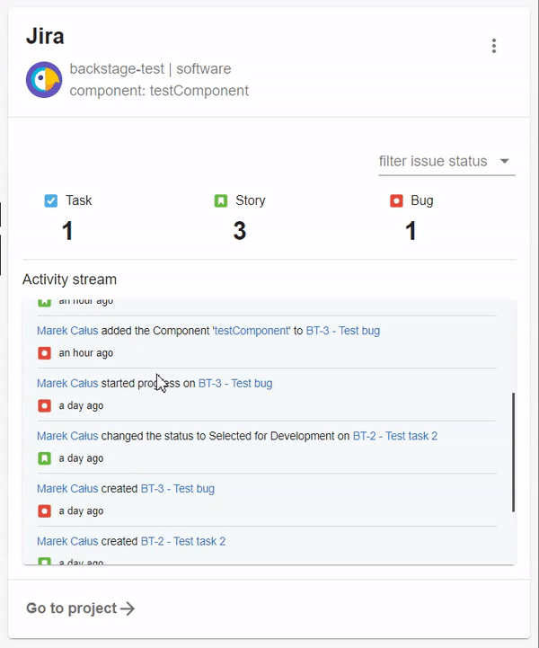

# Jira Plugin for Backstage

.

## Features

- Show project details and tasks
- Activity Stream

## How to add Jira project dependency to Backstage app

1. If you have standalone app (i.e., you didn't clone this repo), then do

```bash
cd packages/app
yarn add @roadiehq/backstage-plugin-jira
```

2. Add proxy config:

```yaml
// app-config.yaml
proxy:
  '/jira/api':
    target: <JIRA_URL>
    headers:
      Authorization:
        $env: JIRA_TOKEN
      Accept: 'application/json'
      Content-Type: 'application/json'
      X-Atlassian-Token: 'no-check'
      # This is a workaround since Jira APIs reject browser origin requests. Any dummy string without whitespace works.
      User-Agent: "AnyRandomString"

jira:
  # Defaults to /jira/api and can be omitted if proxy is configured for that url
  proxyPath: /jira/api
  # Defaults to latest and can be omitted if you wan't to use the latest version of the api
  apiVersion: latest
```

3. Set img-src in Content Security Policy

```yaml
// app-config.yaml
backend:
  # ...
  csp:
    img-src:
      # "'self'" and 'data' are from the backstage default but must be set since img-src is overriden
      - "'self'"
      - 'data:'
      # Allow your Jira instance for @roadiehq/backstage-plugin-jira
      - 'JIRA_URL'

```

4. Add plugin component to your Backstage instance:

```ts
// packages/app/src/components/catalog/EntityPage.tsx
import {
  EntityJiraOverviewCard,
  isJiraAvailable,
} from '@roadiehq/backstage-plugin-jira';

const overviewContent = (
  <Grid container spacing={3} alignItems="stretch">
    ...
    <EntitySwitch>
      <EntitySwitch.Case if={isJiraAvailable}>
        <Grid item md={6}>
          <EntityJiraOverviewCard />
        </Grid>
      </EntitySwitch.Case>
    </EntitySwitch>
  </Grid>
);
```

## How to use Jira plugin in Backstage

1. Add annotation to the yaml config file of a component:

```yaml
metadata:
  annotations:
    jira/project-key: <example-jira-project-key>
    jira/component: <example-component> # optional, you might skip value to fetch data for all components
    jira/token-type: Bearer # optional, used for Activity stream feed. If you are using Basic auth you can skip this.
```

Even though you can use Bearer token please keep in mind that Activity stream feed will only contain entries that are visible to anonymous users. In order to view restricted content you will need to authenticate via Basic authentication, as described in official documentation (https://developer.atlassian.com/server/framework/atlassian-sdk/consuming-an-activity-streams-feed/#authentication).

2. Get and provide `JIRA_TOKEN` as env variable:

   1. Obtain your personal token from Jira: https://id.atlassian.com/manage-profile/security/api-tokens
   2. Create a base64-encoded string by converting "your-atlassian-account-mail:your-jira-token",

      ```js
      // node
      new Buffer('jira-mail@example.com:hTBgqVcrcxRYpT5TCzTA9C0F').toString(
        'base64',
      );

      // in your browser console
      btoa('jira-mail@example.com:hTBgqVcrcxRYpT5TCzTA9C0F');

      // bash
      echo -n 'jira-mail@example.com:hTBgqVcrcxRYpT5TCzTA9C0F' | base64
      ```

      for example `jira-mail@example.com:hTBgqVcrcxRYpT5TCzTA9C0F` converts to `amlyYS1tYWlsQGV4YW1wbGUuY29tOmhUQmdxVmNyY3hSWXBUNVRDelRBOUMwRg==`

   3. Save the environmental variable `JIRA_TOKEN` with `Basic ` prefix, eg: `JIRA_TOKEN='Basic amlyYS1tYWlsQGV4YW1wbGUuY29tOmhUQmdxVmNyY3hSWXBUNVRDelRBOUMwRg=='`

## Links

- [Backstage](https://backstage.io)
- Get hosted, managed Backstage for your company: https://roadie.io
